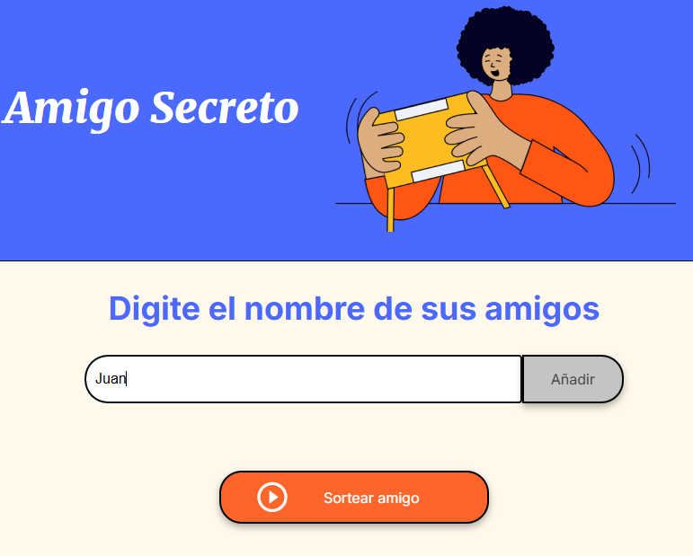

# Amigo Secreto Challange
Solucion al Challenge de amigo de practicando logica de programación.

## Funcionamiento
La solucion de este reto cuenta con varias funciones realizadas para generar una experiencia de usuario mas amena y controlada.
* Se empieza por ingresar los nombre en el capot de texto dandole click al boton añadir,de la siguiente forma:

* Al ingresar amigos, estos se veran reflejados el la lista debajo del campo de texto, asi:

* Para sortear el amigo secreto, tendremos que darle click al boton sortear amigo, al hacer esto el amigo secreto aparecera con un color verde donde estaba la lista de amigos, asi:

### Funciones
```
function agregarAmigo()
```
Se cuenta con la funcion agregarAmigo(), que es la encargada de capturar el nombre del amigo del input y agregarlo a la lista de amigos y dentro de esta llamar a la siguiente funcion.
```
function actualizarLista()
```
La funcion actualizarLista sirve para de forma dinamica ir actualizando la lista de amigos en la interfaz del usuario.
```
function sortearAmigo()
```
Esta funcion se encarga de sortear el amigo a traves de un la seleccion de un numero aleatorio entre los indices de la lista, asi seleccionando el amigo secreto.
```
function actualizarAmigoSecreto(amigoSecreto)
```
Esta función, al igual que la de actualizarLista, se encarga unicamente de actualizar el amigo secreto en la interfaz de usuario y a su vez vaciando la lista de amigos para que solo el amigo secreto revelado sea visto.
```
function limpiarInput()
```
Esta funcion se encarga unicamente de limpiar el input donde se ingresan los nombres de los amigos.

### Validaciones
* No se puede ingresar un nombre vacio

* No se puede sortear un amigo secreto con la lista vacia
